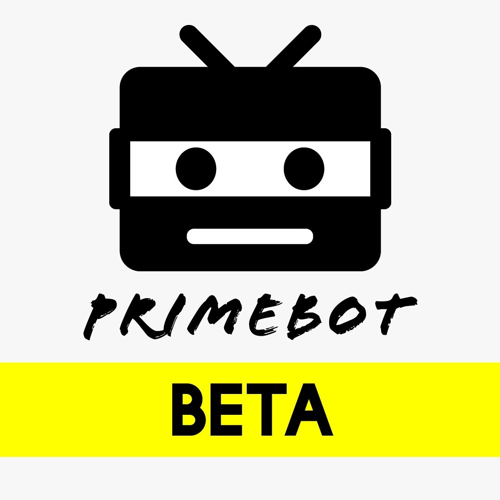
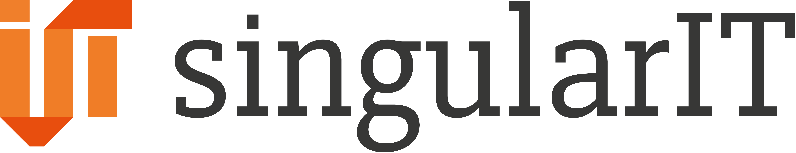

<p align="center">
  <a href="https://www.primebot.me/">
    <picture>
      
    </picture>    
  </a>
</p>
<p align="center">
  
  <a href="https://www.primebot.me">
    
  </a>
  <a href="https://discord.gg/K8bYxJMDzu">
    
  </a>

</p>
<h4 align="center">
The unofficial <i>Strauss Prime League</i> Bot for sending push notifications via Discord and
Telegram.
</h4>

<p align="center">
The bot is not intended to be self-hosted! The server IP of the PrimeBot has been exclusively whitelisted by the Prime
League.
</p>

## Partners

<p align="center">
  <a href="https://www.singular-it.de/">
    <picture>
      <source media="(prefers-color-scheme: dark)"  srcset="./documents/singular_it_dark.png">
      <source media="(prefers-color-scheme: light)" srcset="./documents/singular_it_light.png">
      
    </picture>    
  </a>
</p>
<p align="center">
  <a href="https://www.singular-it.de/">Website</a> |
  <a href="https://blog.singular-it.de/">Blog</a> |
  <a href="https://www.singular-it.de/team">Team</a>
</p>

<h4 align="center">Ihre Spezialist:innen für Data Analytics, webbasierte Systeme und Mobile App-Entwicklungen.</h4>

# Development

### Techstack

- Python
- MariaDB/MySQL
- Django (+ DRF) (python package)
- discord.py (python package)
- Telepot (python package)
- python-telegram-bot (python package)

### Setup

Requirements:

- Python 3.8+
- MariaDB/MySQL
- virtualenv (pip package):  `pip install virtualenv`


1. Clone repository `git clone https://github.com/random-rip/primebot_backend.git`
2. Go into cloned directory `cd primebot_backend` and checkout branch develop ``git checkout develop``
3. Create a virtual environment, for example `virtualenv venv`
4. Activate created venv
    - Linux: `source venv/Scripts/activate`
    - Windows powershell: `.\venv\Scripts\activate`
5. Install requirements `pip install -r requirements.txt`
6. Create `.env` file from `.env.example` at the root folder and set variables according to your setup
    - ``DJANGO_SECRET_KEY``
    - ``DJANGO_DEBUG``
    - ``DJANGO_ALLOWED_HOSTS``
    - Database connection
    - Optional: ``DISCORD_API_KEY`` from [Discord Developerportal](https://discord.com/developers/applications)
    - Optional: ``DISCORD_APP_CLIENT_ID`` from [Discord Developerportal](https://discord.com/developers/applications)
    - Optional: ``TELEGRAM_BOT_API_KEY`` from Telegram Botfather
    - Optional: ``FILES_FROM_STORAGE``
    - Optional: ``LOGGING_DIR``
    - Optional: ``FERNET_SECRET_KEY``
    - Optional: ``SITE_ID``
7. Create a database according to your ``.env``
8. Apply migrations `python manage.py migrate`

For further information have a look at **Contributing** section at the end of the README.

### Project structure

- ``app_prime_league`` contains models, commands and model communications (for example `register_team`)
    - Model ``Match``: Relevant information about a match
    - Model ``Player``: Relevant information about a player (e.g. UserID, summoner_name)
    - Model ``Team``: Relevant information about a team and registered communication platform(e.g. name, tag, picture,
      discord_channel_id, )
    - Model ``ScoutingWebsite``: Holds all possible scouting websites (currently: op.gg, u.gg, xdx.gg,
      leagueofgraphs.com)
    - Model ``Suggestion``: Suggestions of matches
    - Model ``Setting``: settings of teams for notifications, language, etc.
    - Model ``Comment``: comments on matches
- ``bots`` contains all relevant Discord and Telegram scripts, Language files, and the MessageCollector
- ``core`` contains the Prime League communication, parsing, comparing and updating
    - Module ``comparers``: These classes take over the comparison between the database, `TeamDataProcessor`
      and `TemporaryMatchData`.
    - Module ``parsing`` (legacy): The classes take over the parsing of logs passed by the API
    - Module ``processors``: The classes take over the interface between the data processing in python and
      the `provider` classes.
    - Module `providers`: The classes take over the communication with the filesystem, the Prime League API (and the
      differentiation between filesystem and API) and the JSON parsing.
    - Module `updater`: The classes take over updating matches and teams. In production, the updates take place in
      parallel.
    - Module `api.py`: The class provides a low level Prime League api
    - Module `temporary_match_data.py`: The class provides methods for converting the API data into ``Comparer``
      -friendly data and takes care of the data enrichment of opposing teams to a match
- ``storage`` holds the API data as JSON files for development

### Manage.py Commands

- `python manage.py discord_bot` - start Discordbot
- `python manage.py telegram_bot` - start Telegrambot
- `python manage.py update_teams` - synchronize teams 
- `python manage.py update_matches` - synchronize matches
- `python manage.py weekly_notifications` - start weekly notifications
- `python manage.py runscript feedback` - start feedback
- `python manage.py runscript season_messages` - start season notification
- `python manage.py runscript debug` - start debug

### Shell Commands

- `./restart_bots.sh`
- `./run_bots.sh`
- `./update_matches.sh`
- `./update_teams.sh`
- `./weekly_notifications.sh`
- `./feedback.sh`

All shell scripts can be found under `shell_scripts`.

### Testing

```
python manage.py test
```

Some tests refer to I18n and T10n and require compiled ``django.mo`` files. These must be created
with ``python manage.py compilemessages``. This requires the external program gettext:

- [Windows installation](https://www.gnu.org/software/gettext/)
- [Ubuntu installation](https://installati.one/ubuntu/20.04/gettext/)

After that ``python manage.py test`` can be executed.

### Alternative to Prime League API

We have been working on a solution to reduce API requests in development from the very beginning. For this reason each
response of an API request is stored locally in a JSON file. Due to IP whitelisting it is not possible that
the API can be accessed for development. Under ``storage/`` there are sample teams and matches. To use them, in
the `.env` you have to add

```
FILES_FROM_STORAGE="True"
```

After that the ``providers`` use the filesystem.

The files can have dependencies among each other (for example: in team_*.json there is a list of match_ids pointing to
calibration matches or matches from the starter div). For this reason, teams cannot be arbitrarily selected from
the ``storage`` **completely** (a team will still be registered incomplete).

Teams that can be fully registered from storage:

- ``/start 183281`` [DEMACIA FOR WIN (BTZ) Swiss Starter](https://www.primeleague.gg/leagues/teams/183281-demacia-for-win)
- ``/start 114250`` [eWolves Div 4.7](https://www.primeleague.gg/leagues/teams/114250)
- ``/start 90935`` [404-multigaming Div 4.7](https://www.primeleague.gg/leagues/teams/90935)

## Contributing

Feel free to implement new features and create pull requests. Also feel free to create tickets for new features or bugs
even if you cannot implement or fix them. Also, it is not only about programming! We need feedback for features from
teams. Don't hesitate to start a discussion below feature requests.

If you create a pull request, make sure that

- you create one from branch ``develop`` and
- ``python manage.py test`` does not fail.

### Help

Join us on Discord if you have questions. :)

<a href="https://discord.gg/K8bYxJMDzu">

</a>

## License

[](https://github.com/random-rip/primebot_backend/blob/master/LICENSE)

This project is licensed under the terms of the [MIT license](/LICENSE).
